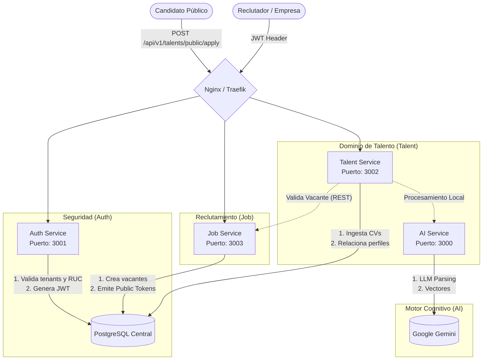

# 🚀 Sistema ATS Múlti-Tenant - Ecosistema de Microservicios

Un Ecosistema moderno, escalable e hiper-acoplado para la Gestión de Talento, impulsado por Procesamiento de Lenguaje Natural (Gemini 2.5) y Seguridad multi-empresa.

## 🏗 Arquitectura del Sistema

Este ecosistema ha sido fragmentado en responsabilidades únicas (Microservicios) utilizando **Fastify** para red y **PostgreSQL** para la persistencia.



## 🛠 Topología de Microservicios

| Servicio | Lenguaje / Fw | Puerto Default | Responsabilidad Principal |
| :--- | :--- | :--- | :--- |
| **Auth Service** | Node + Fastify | `3001` | Registro Multi-tenant, Login, Autenticación (JWT), Validación RUC. |
| **Talent Service** | Node + Fastify | `3002` | Recibe Postulaciones CV, almacena Perfiles, Educación, Skills. |
| **Job Service** | Node + Fastify | `3003` | Administra Departamentos y Vacantes (`draft` a `published`). |
| **AI Service** | Node + Express | `3000` | Micro-Motor que aísla las librerías pesadas de Google AI para estructurado de texto. |

---

## 💻 Entorno Local (Desarrollo)

### Prerrequisitos
- **Docker** y **Docker Compose**
- Node 20+ (Opcional, para ejecución sin Docker)

### Comandos Clave

Levantar todo el ecosistema (Reconstrucción completa de imágenes):
```bash
docker-compose up --build -d
```

Ver los registros del ecosistema agrupados:
```bash
docker-compose logs -f
```

Apagar todo y limpiar la base de datos (¡CUIDADO! Destruye la red local):
```bash
docker-compose down -v
```

---

## 🔒 Variables de Entorno Globales (`.env`)

Para que el ecosistema fluya, el clúster depende de secretos. Si falta uno, los puentes inter-servicios se caerán.

```env
# Database Credentials
DB_USER=postgres
DB_PASSWORD=secret
DB_NAME=talent_platform
DB_HOST=postgres
DB_PORT=5432

# Seguridad Inquebrantable
JWT_SECRET=super_secret_jwt_key_2026
AUTH_DB_PEPPER=global_pepper_2026

# APIs Externas
GEMINI_API_KEY=AIzaSy...

# Conexión Inter-Servicios (No tocar, mapeo DNS Docker)
AUTH_API_URL=http://applik_auth:3001/api/v1
JOB_API_URL=http://applik_job:3003/api/v1
AI_API_URL=http://applik_ai:3000/api/v1
```

## 🚀 Guía Rápida: Flujo E2E (End-to-End)

El ecosistema entero ha sido rigurosamente diseñado para ser ejecutado lógicamente.

1. **La Empresa Inicia:** 
   El reclutador se registra a través del `auth-service`, creando su *Tenant* (RUC válido requerido) y recibe su JWT.
2. **Construyendo la Empresa:** 
   Se crea un departamento bajo su JWT (`job-service`).
3. **Ofreciendo el Puesto:** 
   Se publica una vacante y el sistema emite el `public_token` (`job-service`).
4. **La Llegada del Talento:** 
   Un candidato externo en ruta libre (`talent-service`) envía su CV + el `public_token`. Fastify evade protección, consulta silenciosamente la vacante en `job-service`, mastica el CV mandándolo al `ai-service`, recibe JSON puro y graba al candidato en Postgres en tiempo récord.